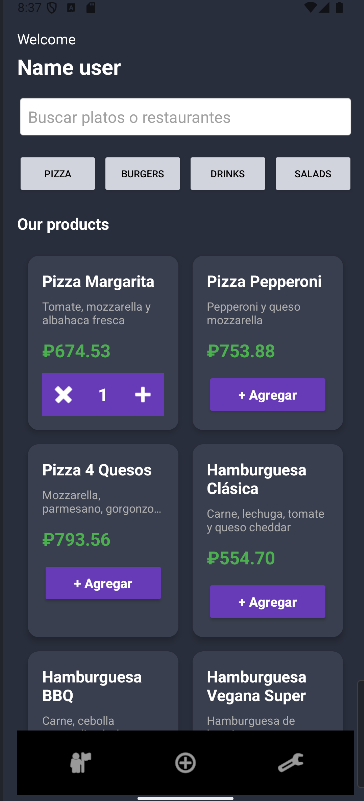
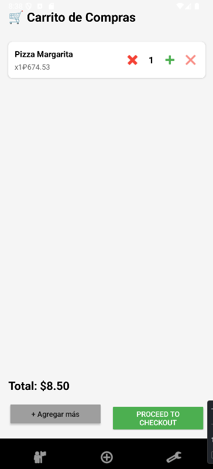
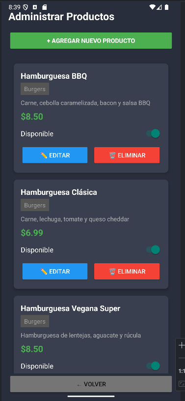
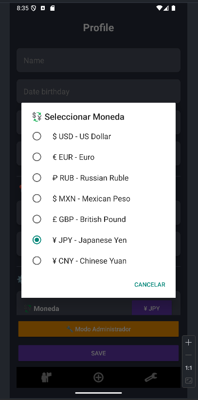
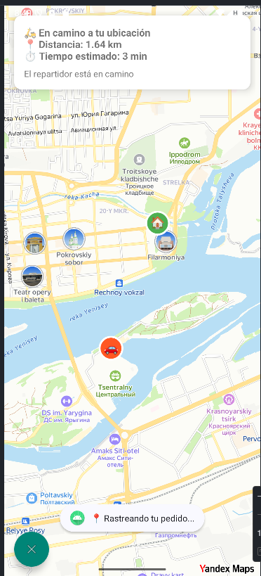

# 🍕 RealFood App

[English](#english) | [Español](#español)

---

<a name="english"></a>
## English

### 📱 About

**RealFood App** is a complete food delivery application developed in Kotlin for Android. It features a product catalog, shopping cart, multi-currency support, admin panel, and order tracking system.

### ✨ Features

- ✅ **Product Catalog**: Browse pizzas, burgers, drinks, and salads
- ✅ **Shopping Cart**: Add products with quantity controls (+/-)
- ✅ **Multi-Currency**: Support for USD, EUR, RUB, MXN, GBP, JPY, CNY
- ✅ **Currency Conversion**: Real-time exchange rates via API
- ✅ **Admin Panel**: Manage products (add, edit, delete, toggle availability)
- ✅ **Password Protection**: Secure admin access
- ✅ **User Profile**: Save delivery address and personal information
- ✅ **Persistent Storage**: Room Database for offline support
- ✅ **Category Filters**: Filter products by type
- ✅ **Search Functionality**: Find products by name or description
- ✅ **Order Tracking**: Track delivery status (in development)

### 🛠️ Technologies Used

#### Core
- **Language**: Kotlin
- **Minimum SDK**: API 26 (Android 8.0)
- **Target SDK**: API 34 (Android 14)
- **Build System**: Gradle (Kotlin DSL)

#### Libraries & Frameworks
- **UI**: Material Design 3, View Binding
- **Database**: Room 2.6.1
- **Networking**: Retrofit 2.9.0, OkHttp 4.12.0
- **Async**: Kotlin Coroutines 1.7.3, Flow
- **JSON**: Gson 2.9.0
- **Architecture**: MVVM pattern

### Configure API Key (Optional - for currency conversion)
- **Currency Exchange**: ExchangeRate-API (free tier)
- Get free API for exchanges key from [ExchangeRate-API](https://www.exchangerate-api.com/) 
- Open `app/src/main/java/com/moondark/realfoodapp/CurrencyManager.kt`
- Replace: private val API_KEY = "YOUR_API_KEY_HERE"
- Get free API for MapKit Yandex [MapKit-API](https://developer.tech.yandex.ru/services/)
- Open `app/src/main/java/com/moondark/realfoodapp/RealFoodApp.kt`
- Replace: MapKitFactory.setApiKey("YOUR_API_KEY_HERE")

### 🚀 Getting Started

#### Prerequisites

- **Android Studio**: Hedgehog (2023.1.1) or later
- **JDK**: 17 or later
- **Android SDK**: API 34
- **Internet connection** (for initial currency rates download)

#### Installation
1. **Clone the repository**


2. **Open in Android Studio**
- File → Open
- Select the `RealFoodApp` folder
- Wait for Gradle sync

3. **Configure API Key** (Optional - for currency conversion)
- Get free API key from [ExchangeRate-API](https://www.exchangerate-api.com/)
- Open `app/src/main/java/com/moondark/realfoodapp/CurrencyManager.kt`
- Replace:
  ```
  private val API_KEY = "YOUR_API_KEY_HERE"
  ```

4. **Run the app**
- Click **Run** ▶️
- Select device/emulator
- App will install and launch

### 🔐 Admin Access

To access the admin panel:

1. Open the app
2. Go to **Settings** (profile icon)
3. Scroll down and tap **🔧 Admin Mode** button
4. Enter password: `admin123` (default)
5. Admin panel will open

**To change admin password:**
Edit `SettingsActivity.kt` line ~48:


### 🗄️ Database Schema

#### Products Table
| Column | Type | Description |
|--------|------|-------------|
| id | Integer | Primary key (auto-increment) |
| name | String | Product name |
| description | String | Product description |
| price | Double | Price in USD |
| category | String | Category (Pizza, Burgers, Drinks, Salads) |
| available | Boolean | Availability status |

#### Cart Items Table
| Column | Type | Description |
|--------|------|-------------|
| productId | Integer | Primary key |
| productName | String | Product name |
| productPrice | Double | Price per unit |
| quantity | Integer | Quantity in cart |

#### Orders Table
| Column | Type | Description |
|--------|------|-------------|
| id | Integer | Primary key (auto-increment) |
| products | String | JSON array of products |
| totalPrice | Double | Total order cost |
| status | String | Order status |
| timestamp | Long | Order creation time |

### 📱 Screenshots

> Add screenshots here
> 
> 
> 
> 
> 
> 

### 🧪 Testing

#### Run on Emulator
./gradlew installDebug
#### Run on Physical Device
1. Enable **Developer Options** on your device
2. Enable **USB Debugging**
3. Connect device via USB
4. Run from Android Studio

### 📦 Building APK

#### Debug APK
./gradlew assembleDebug
Output: `app/build/outputs/apk/debug/app-debug.apk`

#### Release APK
1. Create keystore (first time only)
2. Configure signing in `build.gradle.kts`
3. Build: ./gradlew assembleRelease

Output: `app/build/outputs/apk/release/app-release.apk`

### 🐛 Known Issues

- Order tracking map integration (in development)
- Push notifications (planned feature)

### 🔮 Future Features

- [ ] Google Maps integration for delivery tracking
- [ ] Payment gateway integration (Stripe/PayPal)
- [ ] Push notifications for order updates
- [ ] User authentication (Firebase)
- [ ] Product images from server
- [ ] Order history
- [ ] Favorite products

### 🤝 Contributing

Contributions are welcome! Please feel free to submit a Pull Request.

1. Fork the project
2. Create your feature branch (`git checkout -b feature/AmazingFeature`)
3. Commit your changes (`git commit -m 'Add some AmazingFeature'`)
4. Push to the branch (`git push origin feature/AmazingFeature`)
5. Open a Pull Request

### 📄 License

This project is licensed under the MIT License - see the LICENSE file for details.

### 👤 Author

**Francisco**  
📍 Krasnoyarsk, Russia  
📅 November 2025

### 🙏 Acknowledgments

- ExchangeRate-API for free currency conversion
- Material Design for UI components
- Android Jetpack libraries

---

<a name="español"></a>
## Español

### 📱 Acerca de

**RealFood App** es una aplicación completa de entrega de comida desarrollada en Kotlin para Android. Cuenta con catálogo de productos, carrito de compras, soporte multi-moneda, panel de administración y sistema de seguimiento de pedidos.

### ✨ Características

- ✅ **Catálogo de Productos**: Explora pizzas, hamburguesas, bebidas y ensaladas
- ✅ **Carrito de Compras**: Agrega productos con controles de cantidad (+/-)
- ✅ **Multi-Moneda**: Soporte para USD, EUR, RUB, MXN, GBP, JPY, CNY
- ✅ **Conversión de Divisas**: Tasas de cambio en tiempo real vía API
- ✅ **Panel de Administración**: Gestiona productos (agregar, editar, eliminar, disponibilidad)
- ✅ **Protección por Contraseña**: Acceso seguro al panel de admin
- ✅ **Perfil de Usuario**: Guarda dirección de entrega e información personal
- ✅ **Almacenamiento Persistente**: Room Database para soporte offline
- ✅ **Filtros por Categoría**: Filtra productos por tipo
- ✅ **Funcionalidad de Búsqueda**: Encuentra productos por nombre o descripción
- ✅ **Seguimiento de Pedidos**: Rastrea el estado de entrega (en desarrollo)

### 🛠️ Tecnologías Utilizadas

#### Core
- **Lenguaje**: Kotlin
- **SDK Mínimo**: API 26 (Android 8.0)
- **SDK Objetivo**: API 34 (Android 14)
- **Sistema de Build**: Gradle (Kotlin DSL)

#### Librerías y Frameworks
- **UI**: Material Design 3, View Binding
- **Base de Datos**: Room 2.6.1
- **Networking**: Retrofit 2.9.0, OkHttp 4.12.0
- **Asincronía**: Kotlin Coroutines 1.7.3, Flow
- **JSON**: Gson 2.9.0
- **Arquitectura**: Patrón MVVM

#### APIs
- **Cambio de Divisas**: ExchangeRate-API (nivel gratuito)

### 🚀 Comenzando

#### Requisitos Previos

- **Android Studio**: Hedgehog (2023.1.1) o superior
- **JDK**: 17 o superior
- **Android SDK**: API 34
- **Conexión a internet** (para descarga inicial de tasas de cambio)

#### Instalación

1. **Clonar el repositorio**

2. **Abrir en Android Studio**
- File → Open
- Selecciona la carpeta `RealFoodApp`
- Espera la sincronización de Gradle

3. **Configurar API Key** (Opcional - para conversión de divisas)
- Obtén una API key gratuita de [ExchangeRate-API](https://www.exchangerate-api.com/)
- Abre `app/src/main/java/com/moondark/realfoodapp/CurrencyManager.kt`
- Reemplaza:
  ```
  private val API_KEY = "TU_API_KEY_AQUI"
  ```

4. **Ejecutar la app**
- Click en **Run** ▶️
- Selecciona dispositivo/emulador
- La app se instalará y ejecutará

### 🔐 Acceso de Administrador

Para acceder al panel de administración:

1. Abre la app
2. Ve a **Settings** (ícono de perfil)
3. Desplázate hacia abajo y toca el botón **🔧 Modo Administrador**
4. Ingresa la contraseña: `admin123` (por defecto)
5. Se abrirá el panel de administración

**Para cambiar la contraseña de admin:**
Edita `SettingsActivity.kt` línea ~48:


### 📦 Compilar APK

#### APK Debug
Salida: `app/build/outputs/apk/debug/app-debug.apk`

#### APK Release
1. Crear keystore (solo la primera vez)
2. Configurar firma en `build.gradle.kts`
3. Compilar:
   Salida: `app/build/outputs/apk/release/app-release.apk`

### 🐛 Problemas Conocidos

- Integración de mapa para seguimiento de pedidos (en desarrollo)
- Notificaciones push (característica planeada)

### 🔮 Características Futuras

- [ ] Integración de Google Maps para seguimiento de entrega
- [ ] Integración de pasarela de pagos (Stripe/PayPal)
- [ ] Notificaciones push para actualizaciones de pedidos
- [ ] Autenticación de usuarios (Firebase)
- [ ] Imágenes de productos desde servidor
- [ ] Historial de pedidos
- [ ] Productos favoritos

### 🤝 Contribuir

¡Las contribuciones son bienvenidas! Por favor, siéntete libre de enviar un Pull Request.

1. Haz fork del proyecto
2. Crea tu rama de característica (`git checkout -b feature/CaracteristicaIncreible`)
3. Commit tus cambios (`git commit -m 'Agregar alguna CaracteristicaIncreible'`)
4. Push a la rama (`git push origin feature/CaracteristicaIncreible`)
5. Abre un Pull Request

### 📄 Licencia

Este proyecto está licenciado bajo la Licencia MIT - ver el archivo LICENSE para detalles.

### 👤 Autor

**Francis**  
📍 Krasnoyarsk, Rusia  
📅 Noviembre 2025

